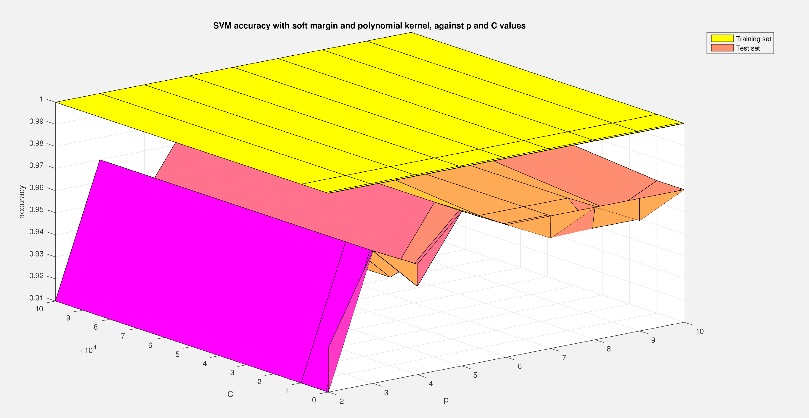

#  Support Vector Machine method for classification of cancerous cells 

## Synopsis ##

This project took place during the module _Neural networks_ at NUS (EE5904R).
It consists of determining whether a breast cell of a given person is cancerous or not. 

### Dataset ###
The samples provided have been obtained by a Fine Needle Aspiration Biopsy and the resulting dataset is called ['Breast Cancer Wisconsin Dataset'](https://archive.ics.uci.edu/ml/datasets/Breast+Cancer+Wisconsin+(Diagnostic)). The different features taken into account in this dataset are: 

- nucleus radius
- texture (standard deviation of gray-scale values)
- perimeter 
- area
- smoothness (local variation in radius lengths) 
- compactness
- concavity
- number of concave portions of the contour
- symmmetry

The nucleus of a cancerous cell is often larger and darker than of a normal cell. Moreover its shape and size is not uniform.

### Support Vector Machine ###
Support Vector Machine (SVM) is a useful machine learning algorithm that can be used as a discriminative classifier. It consists of finding a hyperplane that divides a set of samples into two categories (here, benign and malign cells). Finding an optimal hyperplane means finding the hyperplane that keeps samples as far away as possible from it, in order to make a _margin_ appear around the hyperplane (area without any samples inside). There are two types of margin:

* _hard_ margin, with strictly no samples in the region of separation
* _soft_ margin, with authorized samples in the region of separation. It normally leads to a better generalization of the model. 

Samples on the margin are called _support vectors_. Finding a suitable hyperplane results from the resolution of an optimization problem (quadratic programming), whose formulation is not detailed here. The following figure illustrates the notion of hard and soft margin (2-dimensions case):

  

The use of a kernel is sometimes needed to put the samples into a higher dimensional space and find a suitable hyperplane. Thus I tried different types of kernel such as linear kernel, polynomial kernel of different degrees or Radial Basis Function kernel.

The SVM algorithm has been implemented on Matlab and doesn't use any existing library, with the following main steps:

1. resolution of the optimization problem (quadratic programming) [_coeff_discriminant_function.m_]
2. find the support vectors by defining a criteria to select them [_coeff_discriminant_function.m_]
3. test the model with a tesst dataset [_eval_discriminant_function.m_]

## Results ##

Several cases have been tested:

* a hard margin with a linear kernel [_hardmargin_lin_ker.m_]
* a hard margin with a polynomial kernel [_hardmargin_pol_ker.m_]
* a soft margin with a polynomial kernel [_softmargin_pol_ker.m_]

The best results were found with a soft margin and a polynomial kernel of degree 5: 98% of accuracy. 
Two main parameters have been tuned:

* _p_ : the degree of the polynomial kernel
* _C_ : the penalization factor for soft margin. The larger C is, the bigger the penalization is for a sample which is not well separated by the hyperplane, so the smaller the margin is. Nevertheless it is always hard to draw conclusions about the value of C.

Make the values of _p_ and _C_ vary gives the following results concerning the accuracy of the training set and the test set.

  

The accuracy is globally increasing when _p_ increases. Indeed, when _p_ increases the data are put into a higher dimensional space and are readily separated by a hyperplane.

In a nutshell, Support Vector Machine method is an efficient algorithm for classification and can be interpreted in a geometric way, which is helpful to understand the method and the results obtained.

## Project on GitHub ##

### Project content ###

Programming language: Matlab

* files 'train.mat' and 'test.mat': training and test datasets
* other Matlab files ('.m' extension): Matlab function and scripts to run the program

To make the program run:

1. run _init_ Matlab script to load the datasets into the workspace
2. run either _hardmargin_lin_ker_ / _hardmargin_pol_ker_ / _softmargin_pol_ker_ to apply SVM method 

### Dependencies ###

This Matlab code needs the Matlab function _quadprog_ to solve Quadratic Programming optimization problem.

## Author ##

Mareva Brixy (marevabrixy@gmail.com)

